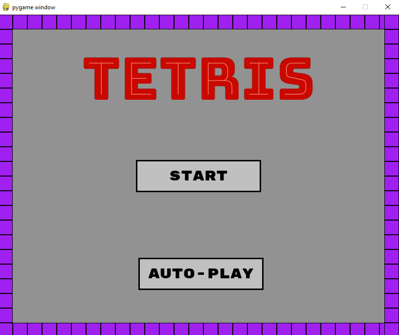
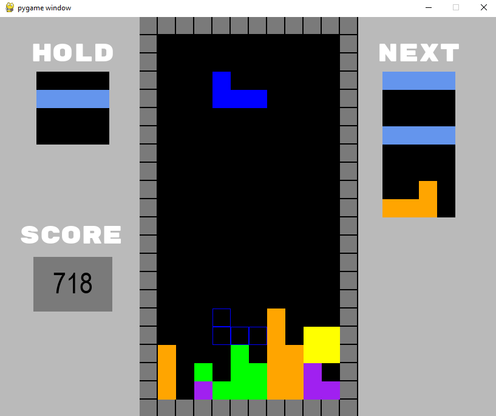

# TETRIS_DQN 🎮🧠

A Deep Q-Network (DQN) agent trained to play Tetris using PyTorch and Pygame. The project integrates a fully functional game engine, custom graphics, and a reinforcement learning loop capable of learning from scratch. Users can play manually or watch the agent play.



---

## 📁 Project Structure
```text
TETRIS_DQN/
├── assets/                # Fonts and sound effects
│    ├── audio/            # Game sound effects (drop, clear, game over, etc.)
│    └── fonts/            # Font files for rendering UI
├── chkpts/                # Checkpointed models (.pth)
├── game/                  # Game engine and graphics
│    ├── Graphics.py       # Handles rendering, font loading, colors
│    ├── Piece.py          # Piece shapes, rotations, and color mapping
│    └── TetrisEngine.py   # GameState class, physics, scoring
├── logs/                  # PNG plot with reward/loss/q_diff training curves
├── models/                # Trained models (final .pth weights)
├── rl/                    # Reinforcement Learning components
│    ├── dqn_agent.py      # DQNAgent with replay buffer, epsilon-greedy logic
│    └── tetris_env.py     # Gym-style wrapper around GameState
├── scripts/               # Training and evaluation
│    ├── train.py          # Runs DQN training loop and saves model
│    └── test.py           # Contains auto_play logic for inference
└── main.py                # GUI launcher with menu: manual play or AI autoplay
```

---

## 🧠 Reinforcement Learning Overview

The project uses a Deep Q-Learning (DQN) approach with experience replay and target network updates.

### 🔁 Reward Function
- **Lines cleared**: Reward = `clear_count² * factor`
- **Height penalty**: Encourages flatter surfaces
- **Holes penalty**: Penalizes holes created
- **Game Over**: Heavy penalty `-5`

### 📊 Logging
Training logs (reward, loss, and Q-value difference) are visualized in a single `training_plot_ep{episode}.png` located in `/logs`.

---

## 🚀 How to Run

### ✅ Prerequisites
Install dependencies:
```bash
pip install -r requirements.txt
```

### 🎮 Launch Game
Run the main launcher, which lets you select manual play or AI autoplay:
```bash
python main.py
```
- Manual Play: Control the pieces yourself using the keyboard.
- Autoplay: Watch the trained DQN agent play automatically.

Note: The scripts/test.py file contains the autoplay logic but is not intended to be run standalone. It is called by main.py when the user chooses AI mode.

### 🧪 Train the Agent
Start training the DQN agent:
```bash
python scripts/train.py
```
- Checkpoints are saved periodically to the chkpts/ directory.
- The final trained model is saved in the models/ directory.
- Training metrics (reward, loss, Q-diff) are saved as a single combined plot image in logs/training_plot.png.



---

## 📊 Logs & Visualization
- Training progress is saved as a single image training_plot.png inside the logs/ folder.
- This PNG shows the evolution of:
    - Total episode rewards
    - Training loss
    - Average Q-value differences (q_diff)
    
No TensorBoard is used; all plots are pre-generated and saved as PNG for convenience.

---

## 🔍 Additional Notes
- The audio effects and fonts are loaded from the assets/audio/ and assets/fonts/ folders respectively.
- The model files are saved as PyTorch .pth files.
- The game engine handles piece rendering, collision detection, line clearing, and scoring.
- The DQN uses experience replay and epsilon-greedy exploration with decay.


